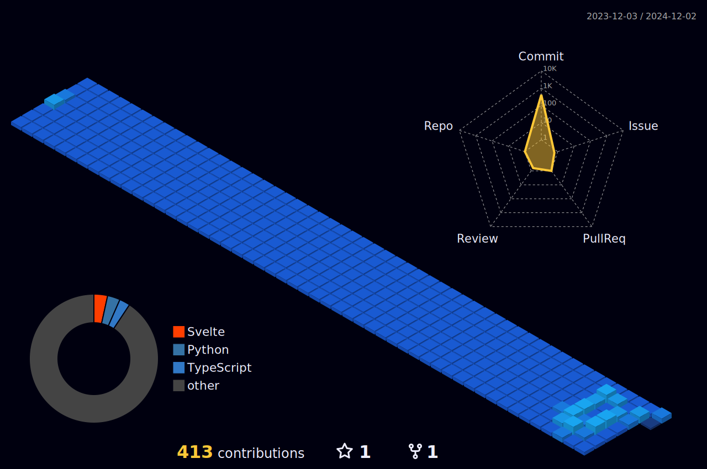

### 
<h3 align=center></h3>
<h3 align=center> Hello, I am Rustacean.</h3>
<h3 align=center>This is my representation 🌓 </h3>
</h3>

 

	

 

 

    
🌓 Blog 🌓

	
	

 

  

<!--
**TheMan1697/TheMan1697** is a ✨ _special_ ✨ repository because its `README.md` (this file) appears on your GitHub profile.

Here are some ideas to get you started:

- 🔭 I’m currently working on ...
- 🌱 I’m currently learning ...
- 👯 I’m looking to collaborate on ...
- 🤔 I’m looking for help with ...
- 💬 Ask me about ...
- 📫 How to reach me: ...
- 😄 Pronouns: ...
- ⚡ Fun fact: ...
-->

